# MyPlaythrough

A full-stack web app to manage your personal video game library — track what you are playing, what you have finished, and what is still on your backlog. Optional community features let you follow other players, share recommendations, and find teammates (LFG).

Developed as the **final intermodular project** for the **Higher Technical Degree in Web Application Development (DAW)** at CESUR Málaga Este (2025/2026), **awarded the maximum grade**.

**Live demo:** deploy the client to Vercel and the API to Render (see [Deployment](#deployment)).

---

## At a glance

| Area | Details |
|------|---------|
| **Stack** | PERN — PostgreSQL, Express 5, React 18, Node.js |
| **Auth** | JWT, bcrypt password hashing, role-based access (`user` / `admin`) |
| **Security** | Parameterized SQL, CORS, rate-limited auth, 50 KB JSON limit, image proxy allowlist |
| **UX** | Skeleton loading, accessible skip link, grid/list collection views, onboarding tour |
| **Social** | Follow users, game recommendations inbox, threaded discussions with Steam-style votes, LFG posts |
| **DevOps** | Docker Compose for local API + Postgres, `render.yaml` for cloud API |

---

## Screenshots

Captured from the local app (1440×900). Regenerate with `node scripts/capture-readme-screenshots.mjs` while client and API are running.

### Sign in

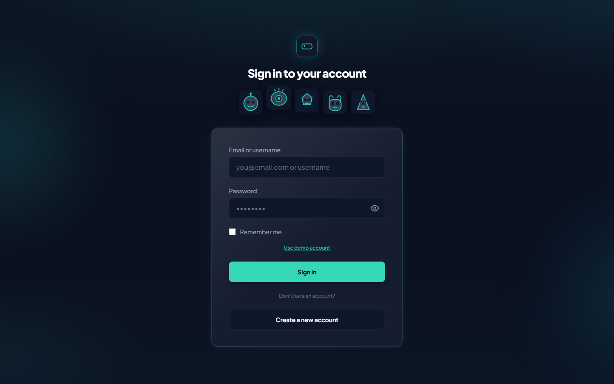

### My collection

Grid view with stats, sorting, and cover art.

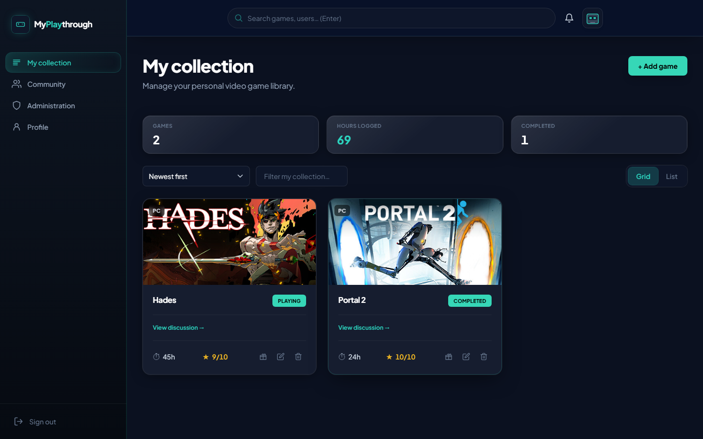

### Community

**Members** — browse profiles and follow other players.

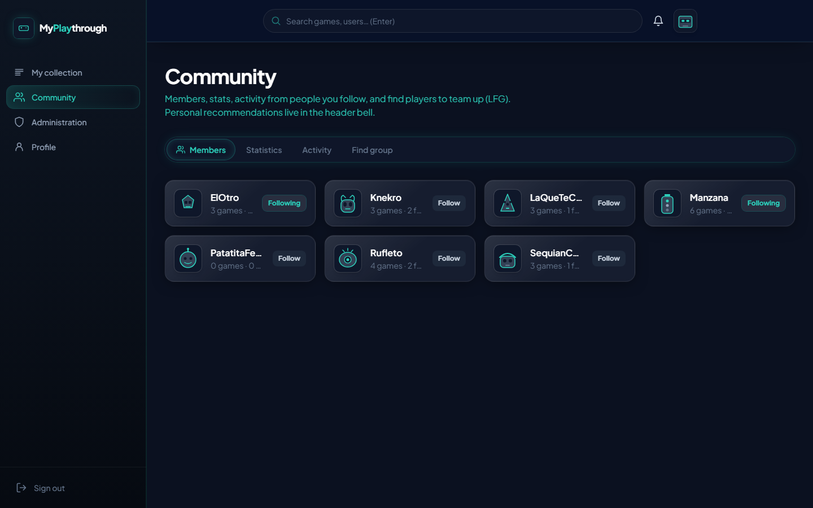

**Statistics** — community-wide average scores per title.

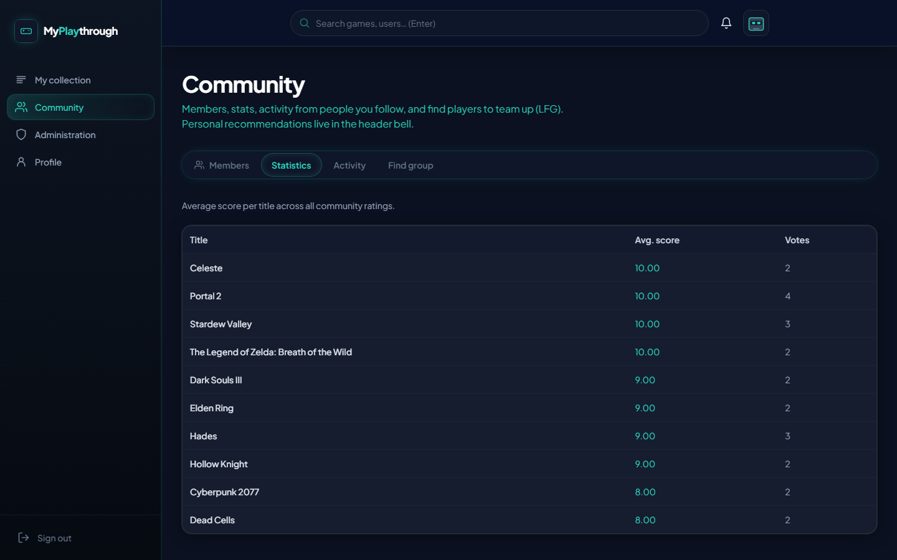

**Activity** — feed from people you follow.

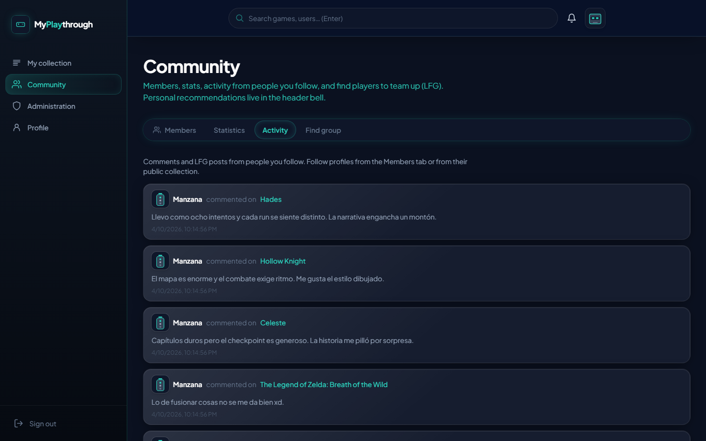

**Find group (LFG)** — post or browse teammate searches tied to your library.

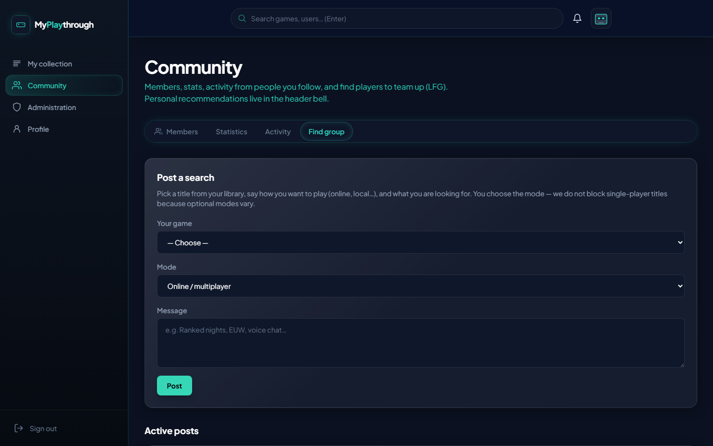

### Add game

Cover search via Steam and RAWG.

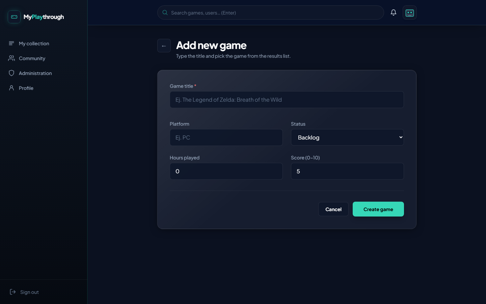

### Profile settings

Display name, robot avatar, notification sound, guided tour.

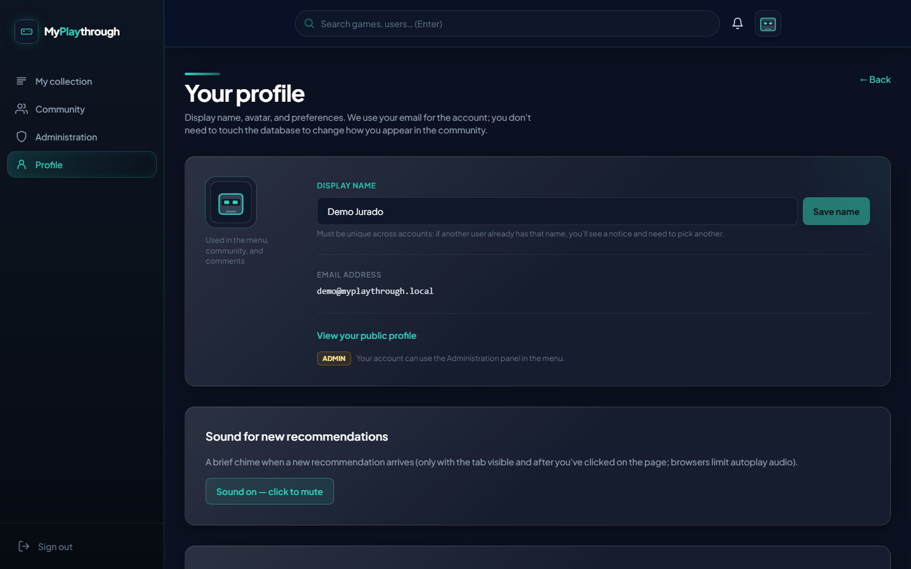

### Recommendations

Inbox for games sent by people you follow.

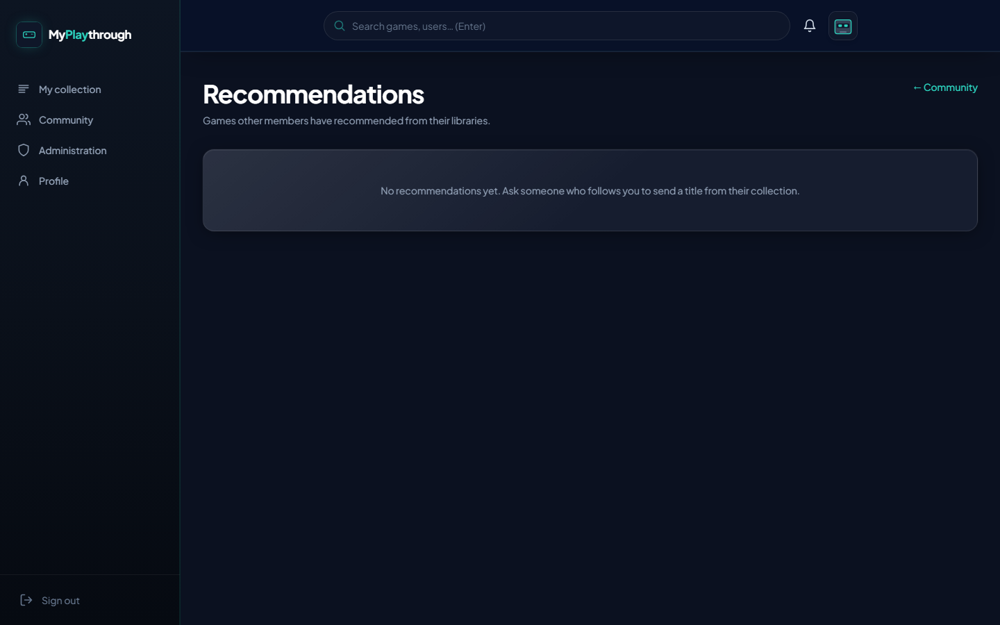

### Search

Global search across members and registered games.

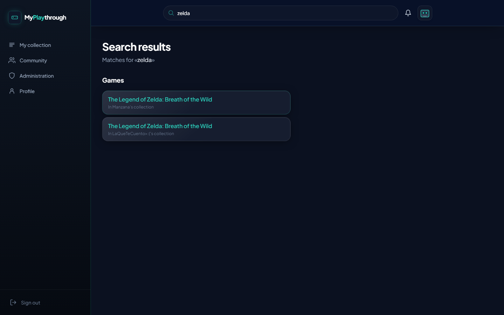

### Game discussion

Threaded reviews with helpful / not recommended votes.

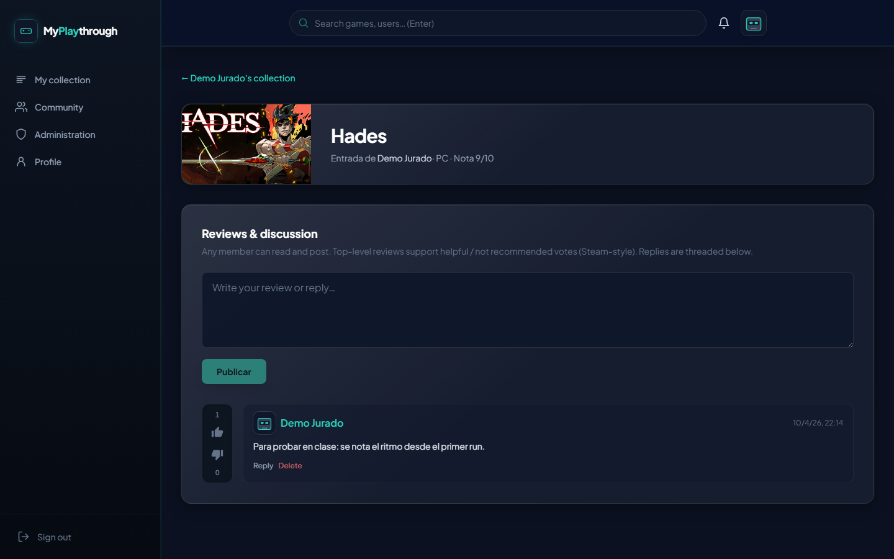

### Public profile

Read-only view of another member's collection.

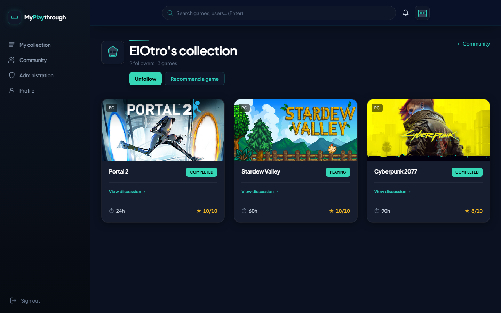

### Administration

User, game, and LFG moderation (admin role).

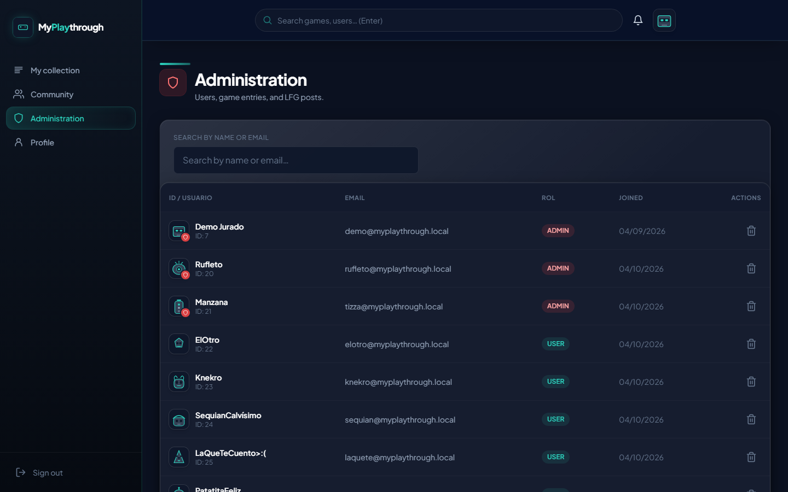

---

## Features

- **Personal collection** — CRUD for games (status, platform, score, hours). Success feedback on the home screen after save.
- **Cover art search** — Steam + [RAWG](https://rawg.io/apidocs) via server-side proxy (`RAWG_API_KEY` recommended).
- **Shared catalogue** — canonical game IDs so cover art is reused across users.
- **Community** — member list, global stats, activity feed, LFG (looking for group).
- **Recommendations** — send a library title to users you follow; header bell with unread count.
- **Avatars** — 10 preset robot SVGs, chosen in Profile settings.
- **Discussions** — nested comments per game entry with helpful / not recommended votes.
- **Admin panel** — user/game/LFG moderation with strict account deletion confirmation.
- **Demo account** — one-click sign-in after running the seed script (see below).

---

## Tech stack

| Layer | Technology |
|-------|------------|
| Frontend | React 18, Vite 7, Tailwind CSS 3, React Router 7 |
| Backend | Node.js, Express 5, JWT, bcryptjs |
| Database | PostgreSQL 14+ |
| Tests | Vitest (client + server) |

---

## Project structure

```
my-playthrough/
├── client/          # React SPA (Vite)
├── server/          # Express REST API
├── docs/            # SQL schema, test plan, HTML docs, screenshots
├── brand/           # Brand book export
└── presentation/    # Slide deck (academic defense)
```

---

## Local setup

**Requirements:** Node.js 18+ and PostgreSQL 14+, or Docker.

### Option A — Docker (API + database)

```bash
docker compose up --build
```

API on **http://localhost:3000**. Postgres exposed on host port **5433** (container `5432`).

### Option B — Manual

1. **Database** — create a DB and run `docs/sql/schema.sql` once.
2. **Backend** — `cd server`, `npm install`, copy `.env.example` to `.env`, set `DB_*`, `JWT_SECRET`, `CORS_ORIGIN`, optional `RAWG_API_KEY`. Run `npm run dev`.
3. **Frontend** — `cd client`, `npm install`, copy `.env.example` to `.env` if the API is not on port 3000. Run `npm run dev` (port **5173**).

### Demo data (optional)

From `server/`:

```bash
npm run seed:demo          # demo user + 3 games (idempotent)
npm run seed:presentation  # full sample dataset for demos
```

Demo credentials after seed: **`demo@myplaythrough.local`** / **`Presentacion2026!`**  
Or use **Try demo account** on the login screen (requires `seed:demo`).

---

## Deployment

### Backend (Render)

1. Connect the repo and apply `render.yaml` (web service + Postgres).
2. Set **`CORS_ORIGIN`** to your Vercel client URL(s).
3. Optionally set **`RAWG_API_KEY`**.
4. Run `docs/sql/schema.sql` on the Postgres instance after first deploy.

### Frontend (Vercel)

1. Import the repo; set **Root Directory** to `client`.
2. Build command: `npm run build` · Output: `dist`.
3. Environment variable: **`VITE_API_URL`** = your Render API URL (e.g. `https://myplaythrough-api.onrender.com`).

`client/vercel.json` provides SPA fallback rewrites.

---

## API overview

| Method | Route | Description | Auth |
|--------|-------|-------------|------|
| POST | `/api/auth/register` | Create account | — |
| POST | `/api/auth/login` | Sign in | — |
| POST | `/api/auth/demo` | Demo sign-in | — |
| GET | `/api/auth/me` | Current user | ✓ |
| PATCH | `/api/auth/me` | Update profile | ✓ |
| CRUD | `/api/games` | Collection | ✓ |
| GET | `/api/users` | Community members | ✓ |
| * | `/api/social/*` | Follows, recommendations, LFG | ✓ |
| * | `/api/admin/*` | Moderation | admin |

Full route definitions live under `server/routes/`.

---

## Security notes

- Passwords hashed with bcrypt (cost 10); policy enforced on client and server.
- Admin role verified from the database on every admin request.
- Auth endpoints rate-limited per IP.
- Production hides `/api/test-db`.

---

## Design

UI design tokens and component patterns: [`DESIGN.md`](DESIGN.md).  
The app UI is **English**. Code identifiers and API paths remain English; internal docs under `docs/` may still include Spanish academic material.

---

## Status

Core features implemented and covered by a manual test plan in `docs/pruebas.md`.

## License

Academic project — contact the author for reuse terms.
